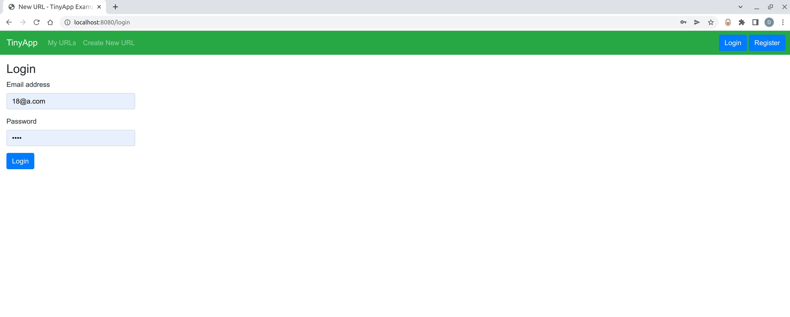
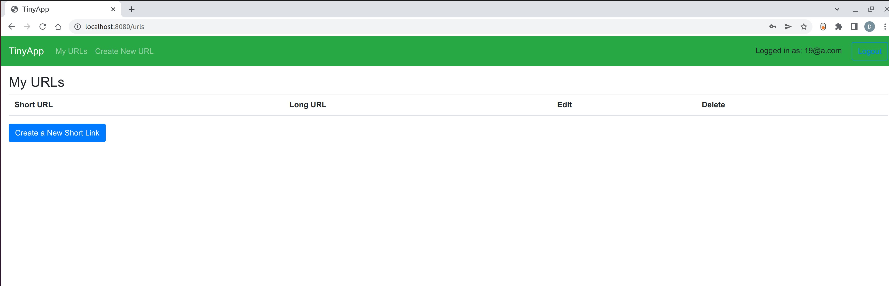
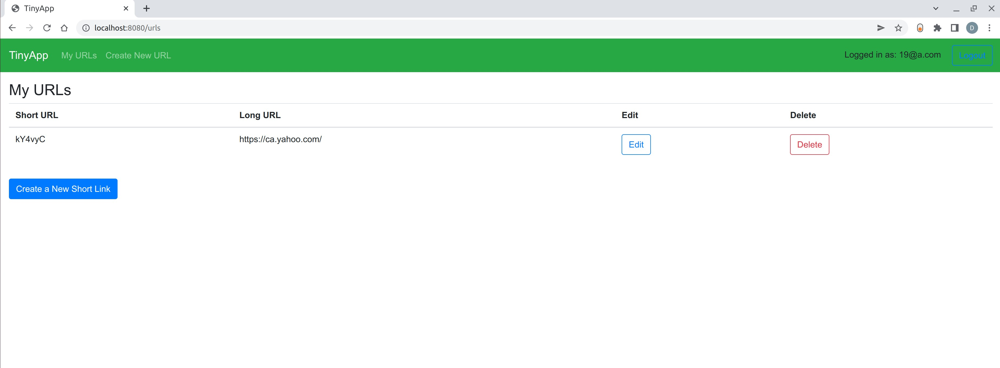

# TinyApp Project

TinyApp is a full stack web application built with Node and Express that allows users to shorten long URLs (à la bit.ly).

## Final Product

#### Screenshot of the Login page

#### Screenshot of creating a new short link

#### Screenshot of a new short link

## Dependencies

- Node.js
- Express
- EJS
- bcrypt
- body-parser
- cookie-session

## Getting Started

- Install all dependencies (using the `npm install` command).
- Run the development web server using the `node express_server.js` command or use the `npm start` command! 
- Go to localhost:8080 or you go straight to http://localhost:8080/urls on your browser!
